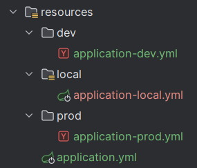
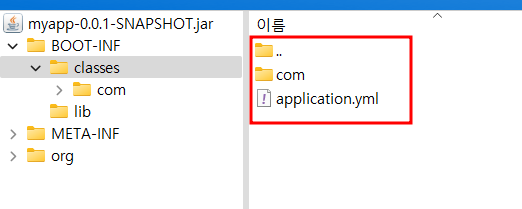

# gradle : 빌드 시, 특정 리소스 제외 시키는 방법

## given



## when

```
sourceSets {
    main {
        resources {
            exclude "**/local/**"
            exclude "**/dev/**"
            exclude "**/prod/**"
        }
    }
}
```

```
./gradlew clean bootJar
```

## then



## 기대 효과

- jar 파일을 생성 할 때, 현 profile과 관련 없는 리소스들은 제외시킬 수 있다.