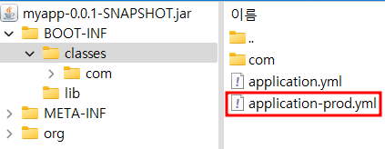

# gradle : 빌드 시, 특정 리소스 추가 시키는 방법

## given


## when

```
// gradle 빌드 시 적용할 profile 지정
ext.profile = project.hasProperty('profile') ? profile : 'local'

// 리소스 디렉토리 관리
sourceSets {
    main {
        resources {
            srcDirs "src/main/resources/${profile}"
            exclude "**/local/**"
            exclude "**/dev/**"
            exclude "**/prod/**"
        }
    }
}
```

```
./gradlew clean bootJar -P profile=prod
```

## then



## 기대 효과

- 리소스 디렉토리 내에 공통 리소스 파일들과 특정 프로파일의 리소스 파일들을 같은 레벨에 담아 관리할 수 있다.