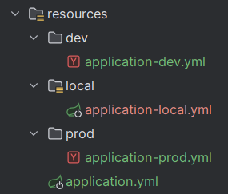
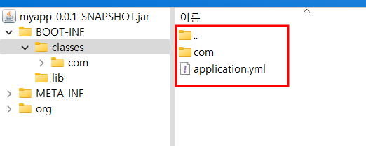

# gradle : 빌드 시 특정 리소스 제외

## given



## when

```
sourceSets {
    main {
        resources {
            exclude "**/local/**"
            exclude "**/dev/**"
            exclude "**/prod/**"
        }
    }
}
```

```
./gradlew clean bootJar
```

## then

