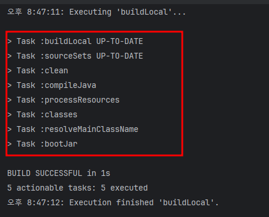
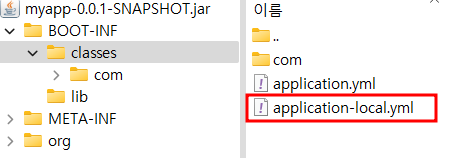
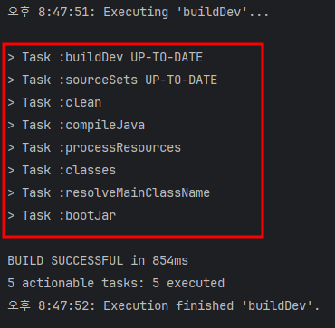
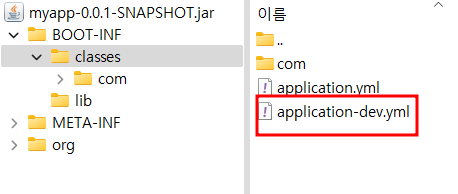
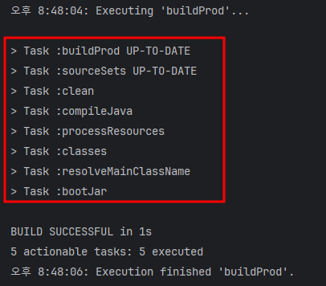
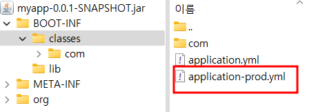

# gradle : 프로파일별 빌드 task 정의

## given

### build.gradle

```
// 속성 정의
ext.profile = project.hasProperty('profile') ? profile : 'local'

// profile 별 리소스 정리
tasks.register("sourceSets") {
    sourceSets {
        main {
            resources {
                srcDirs "src/main/resources/${profile}"
                exclude "**/local/**"
                exclude "**/dev/**"
                exclude "**/prod/**"
            }
        }
    }
}

// build (profile: local)
tasks.register('buildLocal') {
    project.ext.profile = "local"
    finalizedBy "sourceSets"
    finalizedBy "clean"
    finalizedBy "bootJar"
}

// build (profile: dev)
tasks.register('buildDev') {
    project.ext.profile = "dev"
    finalizedBy "sourceSets"
    finalizedBy "clean"
    finalizedBy "bootJar"
}

// build (profile: prod)
tasks.register('buildProd') {
    project.ext.profile = "prod"
    finalizedBy "sourceSets"
    finalizedBy "clean"
    finalizedBy "bootJar"
}
```

## when

### build (profile: local)

```
gradlew buildLocal
```

### build (profile: dev)

```
gradlew buildDev
```

### build (profile: prod)

```
gradlew buildProd
```

## then

### build (profile: local)





### build (profile: dev)





### build (profile: prod)



