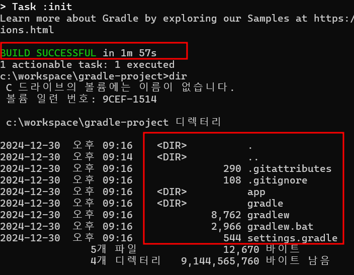
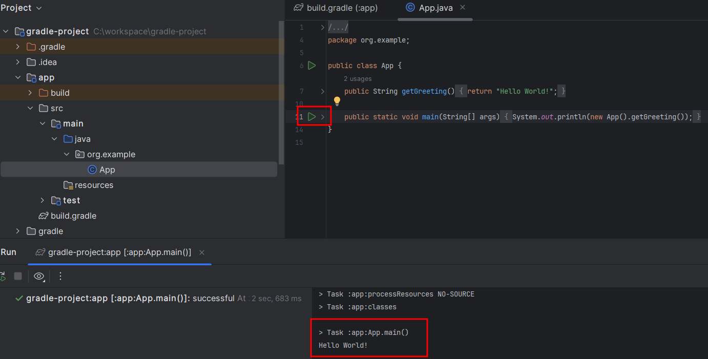

# gradle : Java 애플리케이션(프로젝트) 생성

## given

## when

```
gradle init
```

```
Select type of build to generate:
  1: Application
  2: Library
  3: Gradle plugin
  4: Basic (build structure only)
Enter selection (default: Application) [1..4] 1
```

```
Select implementation language:
  1: Java
  2: Kotlin
  3: Groovy
  4: Scala
  5: C++
  6: Swift
Enter selection (default: Java) [1..6] 1
```

```
Enter target Java version (min: 7, default: 21): 17
```

```
Project name (default: gradle-project):
```

```
Select build script DSL:
  1: Kotlin
  2: Groovy
Enter selection (default: Kotlin) [1..2] 2
```

```
Select test framework:
  1: JUnit 4
  2: TestNG
  3: Spock
  4: JUnit Jupiter
Enter selection (default: JUnit Jupiter) [1..4] 1
```

```
Generate build using new APIs and behavior (some features may change in the next minor release)? (default: no) [yes, no] no
```

## then

### 프로젝트 생성

```
ㄴapp
ㄴㄴbuild.gradle
ㄴㄴbuild
ㄴㄴsrc

ㄴgradle
ㄴㄴwrapper
ㄴㄴㄴgradle-wrapper.jar
ㄴㄴㄴgradle-wrapper.properties

ㄴgradlew
ㄴgradlew.bat
ㄴsettings.gradle
ㄴ.gitattributes
ㄴ.gitignore
```

- gradlew 또는 gradlew.bat은 gradlew 명령을 실행하기 위한 엔드포인트 역할을 한다.
- gradlew 또는 gradlew.bat을 실행 시 내부적으로 gradle-wrapper.jar 프로세스가 실행된다.
- gradle-wrapper.jar은 호스트의 시스템에 gradle이 설치되어 있지 않아도 gradle-wrapper.properties 파일의 버전에 의존하여 gradle을 설치한다.
- build.gradle은 app과 관련한 빌드 스크립트를 명시한다.



