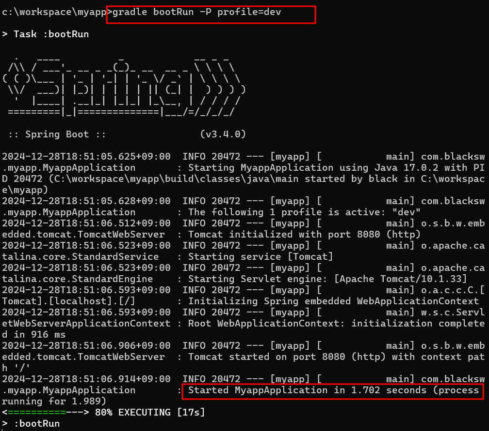

# gradle : title

## given

### build.gradle

```
// 속성 정의
ext.profile = project.hasProperty('profile') ? profile : 'local'

// 리소스 디렉토리 관리
sourceSets {
    main {
        resources {
            srcDirs "src/main/resources/${profile}"
            exclude "**/local/**"
            exclude "**/dev/**"
            exclude "**/prod/**"
        }
    }
}

// 애플리케이션 실행
bootRun {
    args = ["--spring.profiles.active=${profile}"]
}
```

## when

### 애플리케이션 실행

```
gradle bootRun -P profile=dev
```

## then

### 애플리케이션 실행



