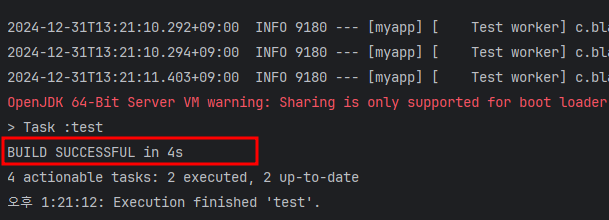
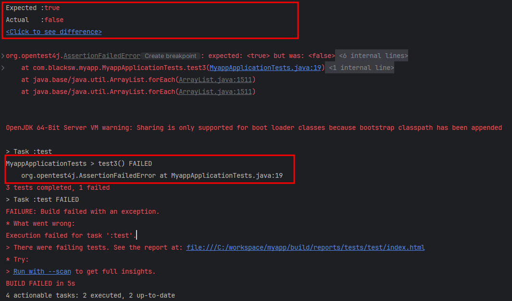
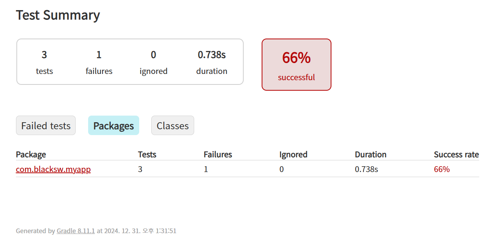

# gradle : 단위 테스트

## given

```
@SpringBootTest
class MyappApplicationTests {

    @Test
    void test1() {
        assertTrue(true);
    }

    @Test
    void test2() {
        assertEquals(2, 1 + 1);
    }

    @Test
    void test3() {
        assertTrue(true);
    }

}
```

## when

### 단위 테스트 수행

```
gradlew test
```

## then

### 사이클

```
> Task :compileJava
> Task :processResources
> Task :classes
> Task :compileTestJava
> Task :processTestResources NO-SOURCE
> Task :testClasses
> Task :test
``` 

### 성공 시



### 실패 시



### 결과 문서

./build/reports/tests/test/index.html

