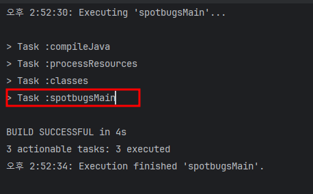
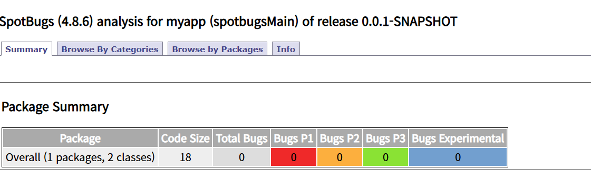

# gradle : 플러그인 SpotBugs 설정

## given

### requiredments

- gradle : 8.11.1
- plugin spotbugs : 6.0.18

### build.gradle

```
// plugin spotbugs 추가
plugins {
    id 'com.github.spotbugs' version '6.0.18'
}

// task spotbugsMain 설정
tasks.spotbugsMain {
    reports.create("html") {
        required = true
        outputLocation = layout.buildDirectory.file("reports/spotbugs.html")
        setStylesheet("fancy-hist.xsl")
    }
}
```

## when

```
gradlew spotbugsMain
```

## then



